## Farm 指南

> 平台除了Staking质押，还提供高收益的流动性挖矿池，用户通过Staking+Farm的组合模式可以获得比普通Staking更高的收益回报。

为了提高流动性提供者的收益，并促进KiKi Finance的生态系统，我们为LP持有者提供了Staking功能。在KiKi提供流动性的用户，可以在KiKi Farms页面上质押交易对，以挖掘额外的KiKi币。Staking的目的是持续丰富KiKi生态系统，为KiKi Finance的贡献者带来更多的利益。

任何此页面的操作，都是在钱包已连接的前提下。关于钱包的安装与连接，详细请参看：

[钱包的安装与连接]()

### Stake LP Tokens

1. 点击 **Farms** 并选择交易对。

   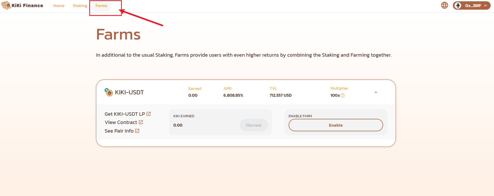

   

2. 点击 **Get KIKI-USDT LP** 跳转至 Uniswap 页面。

   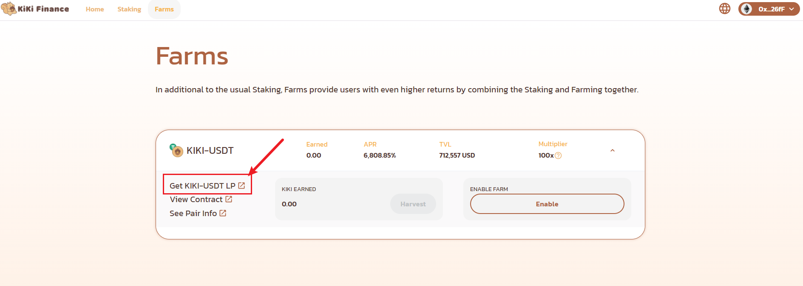

3. 输入你想挖矿的两个币种分别对应的数量。

   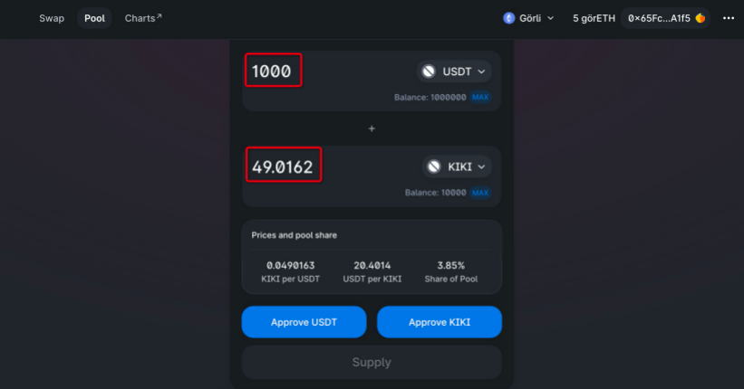

4. 点击 **Approve USDT** 和 **Approve KIKI** 分别授权交易币对。

   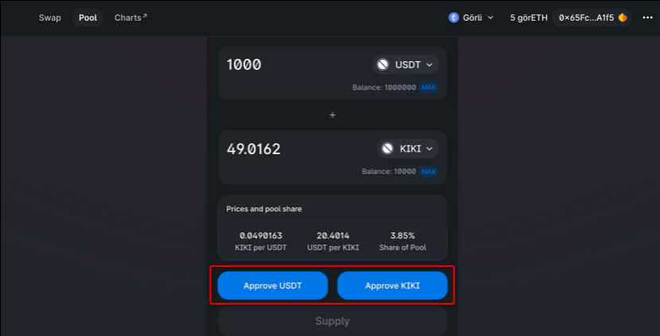

5. 点击 **Confirm Supply** 确认交易。

   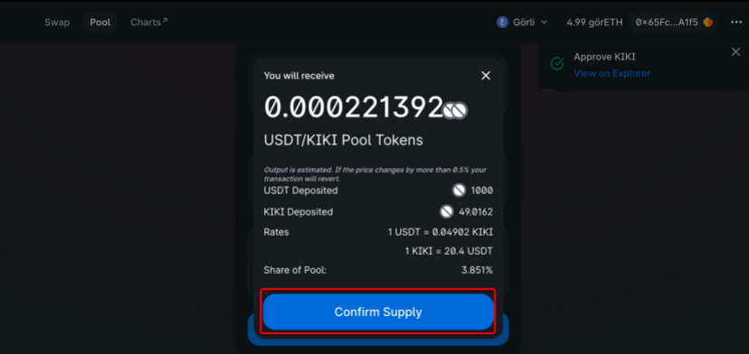

6. 提交交易后，返回KiKi页面

   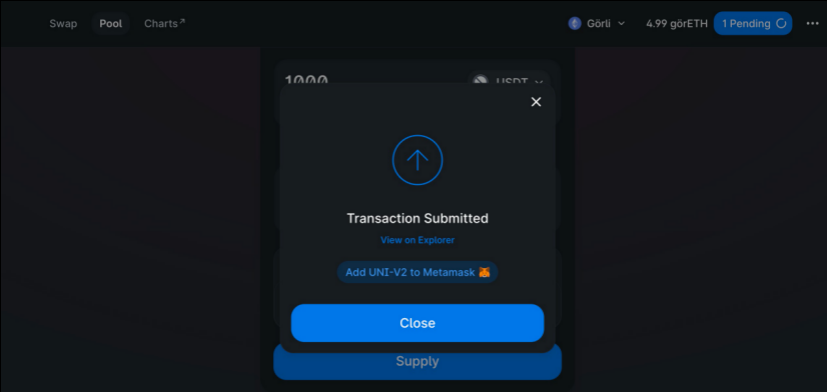

7. 点击 **Enable**, 并在钱包中批准LP消费，稍等片刻后，**Enable**按钮会变更为**Stake LP**

   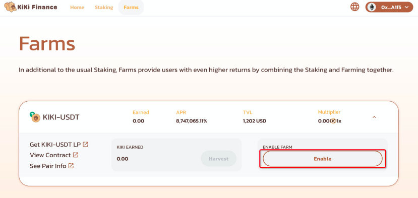

8. 点击 **Stake LP** 进行质押挖矿。

   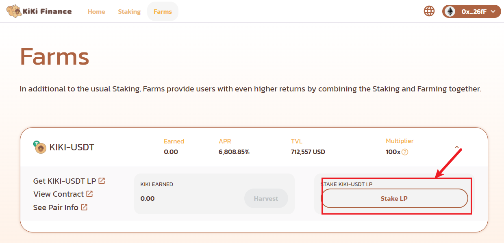

9. 输入你想质押挖矿的交易对代币数量，并点击 **Confirm**，并在弹出的钱包页面中确认交易

   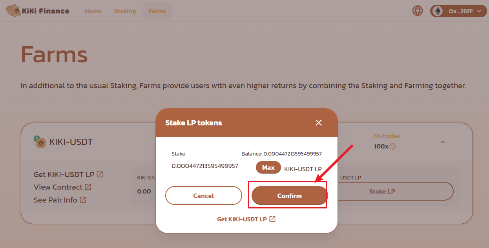

10. 链上确认交易后，您将能看到质押的交易代币和挖矿数量如下：

    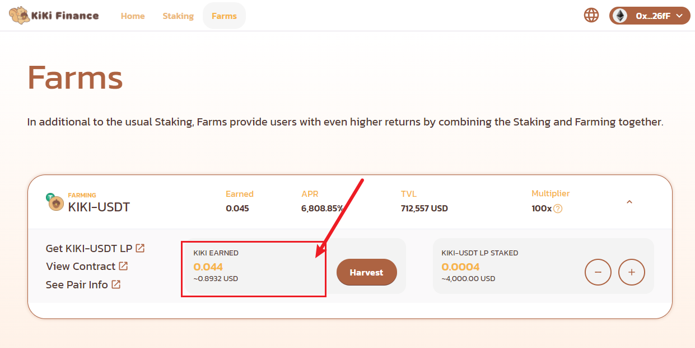

### Harvest

在farm页面，可以看到你的质押收入，如果你想将收益纳入你的账户，请按照以下流程进行harvest

1. 点击Harvest, 并在弹出的钱包对话框中，确认交易

   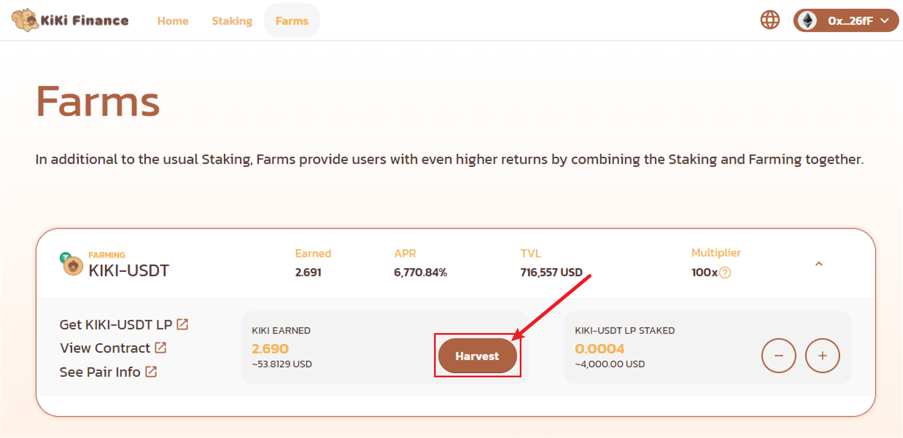

2. 等待链上交易确认完成后，你将看到这样的提示，并可以在你的钱包中，看到通过farm得到的KiKi已到账

   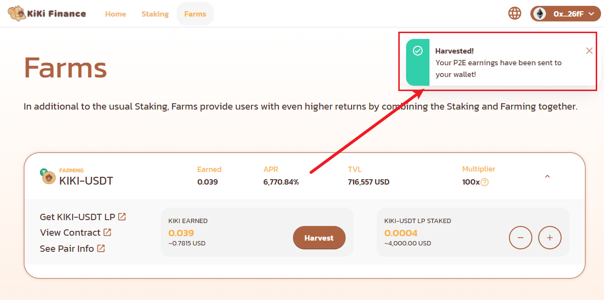

### Unstake LP Tokens

> 该操作会影响你的收益，请谨慎操作

在你需要取消LP的质押时，请按以下流程操作

1. 点击以下页面所表示的“-”号 （“+”号表示你可以继续质押你的LP Token）

   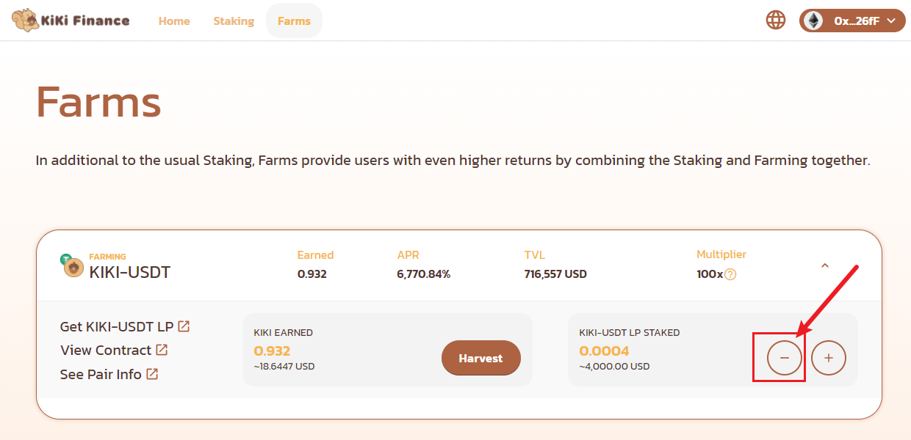

2. 输入你要取消质押的LP Token的数量，并点击Confirm,在弹出的钱包对话框中，确认交易

   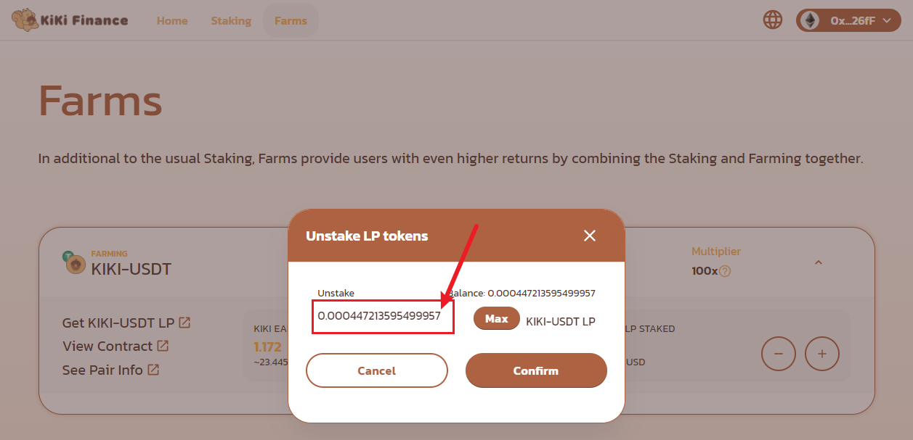

3. 等待链上的交易完成后，页面会有一条unstake成功的提示,表示Unstake LP Tokens成功

   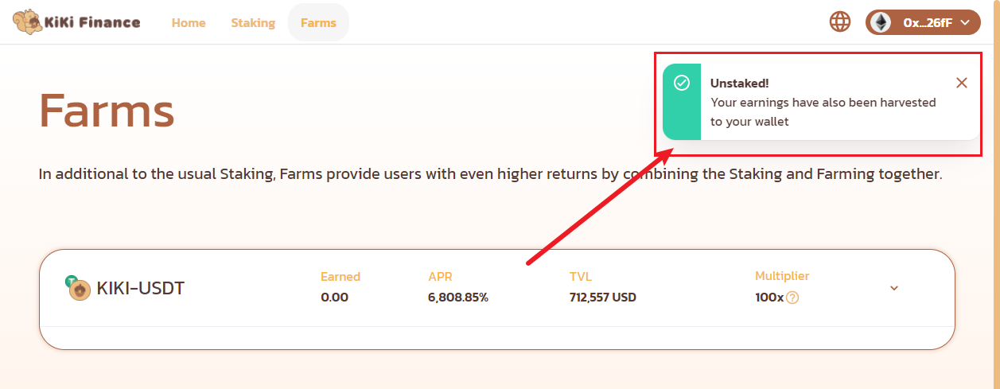

